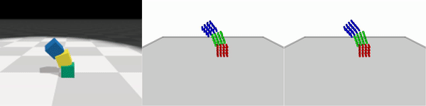

# Visual Grounding of Learned Physical Models

Yunzhu Li, Toru Lin*, Kexin Yi*, Daniel M. Bear, Daniel L. K. Yamins, Jiajun Wu, Joshua B. Tenenbaum, and Antonio Torralba

**ICML 2020**
[[website]](http://visual-physics-grounding.csail.mit.edu/) [[paper]](https://arxiv.org/abs/2004.13664) [[video]](https://www.youtube.com/watch?v=P_LrG0lzc-0&feature=youtu.be)

## Evaluate the trained model on the test data

Create a folder named `data/` in the project folder and download the test data from the following links. Unzip and put them in `data/`.
- MassRope [[DropBox]](https://www.dropbox.com/s/l3fx5onv21ti72p/data_MassRope_valid.zip?dl=0) (2.8 GB)
- RigidFall [[DropBox]](https://www.dropbox.com/s/o3ehs4s4p13kuy6/data_RigidFall_valid.zip?dl=0) (7.35 GB)

### 1. Dynamics Prior

Type the following commands to evaluate the dynamics prior. You can also take a look at [[VGPL-Dynamics-Prior]](https://github.com/YunzhuLi/VGPL-Dynamics-Prior), which we prepared as a stand-alone module for dynamics prediction.

    bash scripts/dynamics/eval_MassRope_dy.sh
    bash scripts/dynamics/eval_RigidFall_dy.sh
    
You will be able to generate videos like the following

  
    
### 2. Parameter Estimation

Type the following command to evaluate the model's performance on parameter estimation on 50 testing examples.

    bash scripts/parameter/eval_MassRope_param.sh
    bash scripts/parameter/eval_RigidFall_param.sh
    
- MassRope: Average error ratio: 2.8812% (std: 1.2736)
- RigidFall: Average error ratio: 3.7455% (std: 2.6649)
    
### 3. Position Refinement and Rigidness estimation

Type the following command to evaluate the model's performance on position refinement and rigidness estimation on 50 testing examples.

    bash scripts/position/eval_MassRope_pos.sh
    bash scripts/position/eval_RigidFall_pos.sh
    
Position Mean Squared Error (scaled by 1e4):
- MassRope: Before refinement 1.9584, After refinement 0.4782
- RigidFall: Before refinement 1.9700, After refinement 1.4500

### 4. Forward prediction using the inference results

Type the following command to evaluate the model's performance on forward prediction using the inference results.

    bash scripts/forward/eval_MassRope_fwd.sh
    bash scripts/forward/eval_RigidFall_fwd.sh

The generated videos are stored in `dump/dump_{ENV}/eval_forward*`. The following are two demos, where we show the original RGB image, the prediction, and the ground truth from left to right.

  

## Train the model

For training the dynamics prior, please refer to [[VGPL-Dynamics-Prior]](https://github.com/YunzhuLi/VGPL-Dynamics-Prior), which we prepared as a stand-alone module for dynamics prediction.

For training the dynamics-guided inference module, we have provided the following training scripts

    scripts/parameter/train_MassRope_param.sh
    scripts/position/train_MassRope_pos.sh
    
    scripts/parameter/train_RigidFall_param.sh
    scripts/position/train_RigidFall_pos.sh
    
To obtain the training data, which is about nine times the size of the test data, please contact me through `liyunzhu@mit.edu`.

## Citing VGPL

If you find this codebase useful in your research, please consider citing:

    @inproceedings{li2020visual,
        Title={Visual Grounding of Learned Physical Models},
        Author={Li, Yunzhu and Lin, Toru and Yi, Kexin and Bear, Daniel and Yamins, Daniel L.K. and Wu, Jiajun and Tenenbaum, Joshua B. and Torralba, Antonio},
        Booktitle={ICLR},
        Year={2020}
    }

    @inproceedings{li2019learning,
        Title={Learning Particle Dynamics for Manipulating Rigid Bodies, Deformable Objects, and Fluids},
        Author={Li, Yunzhu and Wu, Jiajun and Tedrake, Russ and Tenenbaum, Joshua B and Torralba, Antonio},
        Booktitle={ICLR},
        Year={2019}
    }
